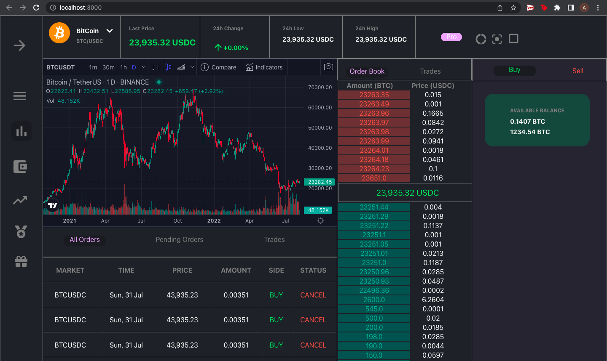

# Trading Desk (React) Coding Assessment

## Overview

To do this assessment, these [instructions](https://github.com/gurukishore111/VIT-assessment-2) were followed.

## Application Functionalities

- Side Bar with Icons
- Top Bar with Section
- Real Time Graph
- Table for Transactions
- Dynamic Order Sheet

## Improvements

Currently the project does not have the bids section in the order book and the formatting for the asks in not complete. BUY/SELL Column is incomplete along with some minor UI/UX issues.

## What could have been different with more time

With more time, the Formatting of Dynamic View of the Order Book could have been done as the BUY/SELL Column both of which are incomplete as of now.

## Setup

- Clone this repo
- `npm install` - To install the dependencies
- `npm run server` - To start the JSON server
- `npm start` - To start the react app

## Screenshots of the project

## Conclusion

While this isn't the best work I've done, I enjoyed working on this project and am looking forward to any and all feedback! Thank You for the Opportunity

---
